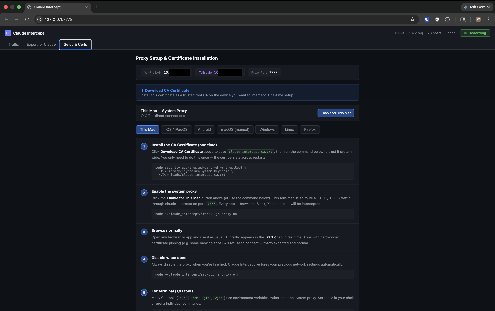

# ⊕ Claude Intercept

A lightweight MITM (man-in-the-middle) proxy for capturing and analyzing HTTP/S traffic — built for use with [Claude Code](https://claude.ai/code).

Capture traffic from your Mac, iPhone, Android, or any device on your network. Inspect it in a real-time dark-themed dashboard, then feed it directly to Claude for analysis: document undiscovered APIs, extract auth tokens, map request patterns, and more.



---

## Features

- **Real-time traffic dashboard** — live request list with method/status badges, body inspection, and header viewer
- **HTTPS interception** — full TLS unwrapping via a per-machine CA certificate (unique to your machine, private key never leaves disk)
- **Multi-device support** — capture from this Mac, iPhone, Android, or any device on the same network or via Tailscale
- **Device labeling** — each request tagged with its source (This Mac, iPhone, iPad, Android, etc.) with a Device filter dropdown
- **Bulk actions** — select, export, or delete multiple requests at once
- **Pause / resume** — stop capturing without interrupting device internet access
- **Claude Code `/intercept` skill** — start, analyze, and export from the terminal without touching the browser
- **Export modes** — `api-docs`, `auth`, `summary`, `full` — structured output optimized for Claude analysis
- **QR code cert install** — scan to install the CA cert on iOS/Android, no typing required
- **Tailscale support** — detects and displays your Tailscale IP for remote device access
- **Zero native compilation** — uses Node.js built-in `node:sqlite` (no `node-gyp`, no Xcode build step)

---

## Requirements

- **Node.js v22.5+** (uses built-in `node:sqlite` — no native compilation needed)
- **macOS** for the system proxy toggle (Linux/Windows manual proxy config works too)
- **Claude Code** for the `/intercept` skill (optional but recommended)

---

## Installation

```bash
git clone https://github.com/your-username/claude-intercept.git ~/claude_intercept
cd ~/claude_intercept
bash install.sh
```

The installer:
- Verifies Node.js version
- Runs `npm install`
- Installs the `/intercept` Claude Code skill
- Links `claude-intercept` to your PATH

---

## Quick Start

### Option A — Claude Code skill

In any Claude Code session:
```
/intercept
```
Claude will start the proxy, open the dashboard, and guide you through setup.

### Option B — CLI

```bash
claude-intercept start
```

This starts:
- **Proxy** on `http://127.0.0.1:7777`
- **Dashboard** on `http://127.0.0.1:7778`

---

## CLI Reference

```
claude-intercept <command> [options]
```

| Command | Description |
|---------|-------------|
| `start` | Start proxy + dashboard (opens browser automatically) |
| `start --proxy-port 9090 --ui-port 9091 --no-open` | Custom ports, no auto-open |
| `stop` | Stop a running instance |
| `status` | Check if running, show capture stats |
| `clear` | Delete all captured traffic |
| `cert` | Print path to the CA certificate |
| `export --mode api-docs` | Export for Claude — document discovered APIs |
| `export --mode auth` | Extract Bearer tokens, cookies, API keys |
| `export --mode summary` | High-level traffic overview |
| `export --mode full --host api.example.com` | Full headers + bodies for one host |
| `proxy on` | Enable system proxy on this Mac |
| `proxy off` | Disable system proxy |
| `proxy status` | Show current system proxy state |

---

## Setup by Device

### This Mac

1. Open the dashboard → **Setup & Certs** tab
2. Click **Enable for This Mac** — macOS will prompt for your password
3. Browse normally — all HTTP/S traffic is now captured

> **Remember to disable** when done (`proxy off` or the Disable button in the dashboard). Leaving the proxy on after stopping the server will break your network connection.

### iPhone / iPad

1. Install the CA certificate:
   - In the dashboard **Setup & Certs → iOS/iPadOS**, scan the QR code with your iPhone camera
   - Tap the link in Safari → install the profile in Settings
   - Go to **Settings → General → About → Certificate Trust Settings** → enable Claude Intercept CA
2. Configure proxy: **Settings → Wi-Fi → [network] → Configure Proxy → Manual**
   - Server: your Mac's LAN IP (shown in the dashboard)
   - Port: `7777`
3. Traffic from all iPhone apps now appears in the dashboard

### Android

1. Configure proxy: **Settings → Wi-Fi → long-press network → Modify → Proxy: Manual**
   - Hostname: your Mac's LAN IP
   - Port: `7777`
2. Install the CA cert: open Chrome → navigate to `http://[Mac IP]:7778/api/cert`
   - Install via Settings → Security → Install certificate → CA certificate

### macOS (manual)

System Settings → Network → Wi-Fi → Details → Proxies:
- Enable **Web Proxy (HTTP)** and **Secure Web Proxy (HTTPS)**
- Set both to `127.0.0.1` port `7777`

Install the CA cert:
```bash
sudo security add-trusted-cert -d -r trustRoot \
  -k /Library/Keychains/System.keychain \
  ~/claude_intercept/certs/ca.crt
```

### Firefox

Firefox uses its own cert store. Install via:
**Settings → Privacy & Security → View Certificates → Authorities → Import**

Select `~/claude_intercept/certs/ca.crt` and trust it for websites.

---

## Analyzing Traffic with Claude

### From the dashboard

1. Check the boxes next to requests you want to analyze
2. Click **Export Selected →** → choose an export mode → **Generate Export**
3. Copy the output and paste into Claude

### From Claude Code

```
/intercept
```
Then ask Claude directly:
- *"Analyze the last 50 requests and document all API endpoints"*
- *"Extract all auth tokens from today's captures"*
- *"What authentication pattern is this app using?"*

Claude will run the export, read the output, and give you a full analysis — no copy/paste needed.

---

## Security & Privacy

- The CA private key is generated once on your machine and stored at `certs/ca.key`. It never leaves your machine and is excluded from git.
- Each machine gets a unique CA — certificates from one installation cannot decrypt traffic intercepted by another.
- All captured data is stored locally in `captures/captures.db` (SQLite), also excluded from git.
- The dashboard binds to `0.0.0.0` so phones on your LAN can reach it — do not run this on untrusted networks.

> **This tool is for authorized testing and personal use only.** Only intercept traffic from devices and accounts you own or have explicit permission to test.

---

## Architecture

```
claude_intercept/
├── src/
│   ├── cli.js              # Commander-based CLI entry point
│   ├── analyze.js          # Export formatter for Claude (api-docs / auth / summary / full)
│   ├── setup_wizard.js     # Per-platform setup instructions
│   ├── system_proxy.js     # macOS/Linux/Windows system proxy toggle
│   ├── proxy/
│   │   ├── index.js        # MITM proxy — HTTP forward + CONNECT tunnel + TLS unwrap
│   │   └── cert_manager.js # CA generation + per-host certificate signing (node-forge)
│   ├── storage/
│   │   └── db.js           # SQLite via node:sqlite — captures schema + query API
│   └── ui/
│       ├── server.js       # Express REST API + WebSocket broadcast
│       └── public/
│           └── index.html  # Single-file dashboard (vanilla JS, dark theme)
├── skill.md                # Claude Code /intercept skill definition
├── install.sh              # Installer (deps, skill, PATH link)
├── captures/               # Runtime — SQLite DB (gitignored)
└── certs/                  # Runtime — CA + leaf keys (gitignored)
```

**Key design decisions:**

- **`node:sqlite`** (built-in, Node 22.5+) — zero native compilation, works everywhere without build tools
- **`node-forge`** for certificate generation — pure JS, no OpenSSL dependency
- **Single HTML file** dashboard — no build step, no bundler, easy to audit
- **Pause at capture layer** — proxy keeps forwarding traffic so devices don't lose internet when paused
- **Per-host cert caching** — certs generated on first CONNECT, reused on subsequent connections

---

## Contributing

PRs welcome. Please test against Node 22.5+.

---

## License

[CC BY-NC 4.0](LICENSE) — free for personal and non-commercial use, attribution required.
